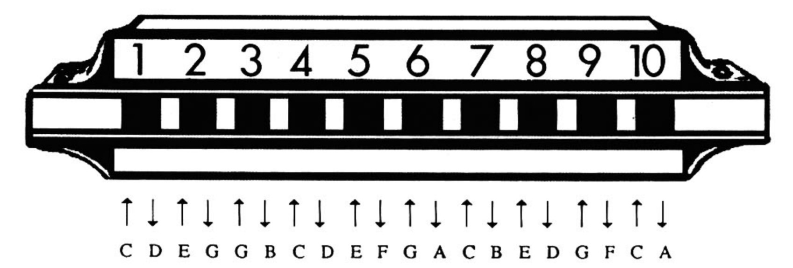

# 前言

真的，只要稍加学习和练习，任何人都能吹奏口琴，而本教材将使你有机会学习演
奏各种风格的音乐一包括摇滚、布鲁斯、民歌、以及古典音乐。本书所介绍的通俗易懂、
循序渐进的方法将指导你学习口琴演奏的各种基本技巧一并且将使你掌握独自吹奏成
百上千首新歌的技巧。你将在吹奏流行热门歌曲的过程中加强并发展这些重要的演奏技
巧，届时你将吹奏埃尔维斯·普莱斯里、卡特．斯蒂文斯、“沙滩男孩"小组、“动物"小组的
流行金曲，并将吹奏罗伯特．约翰逊、詹姆斯·泰勒、裘迪·柯林斯以及埃拉·菲茨杰拉德录
制的一些令人难以忘怀的歌曲。在学习本教材的过程中，你逐渐掌握各种专业性的独奏
技巧，其中既有像运舌法、句法处理和手震音这样的传统民歌、流行和古典技法，也有像
降音、滑音、颤音以及“哇哇"声这样的布鲁斯和摇滚技法

## 口琴简史

口琴（也被称作口风琴）是一种管乐器。早期的口琴有两种形式，一种是1、821年由F
布什曼发明的，另一种也被称作“阿奥莉纳"，是1829年由查尔斯·惠特斯顿发明的。在十
九世纪三十年代，马蒂亚斯．霍赫纳发明了另一种形式的口琴，很像我们今天使用的现代
口琴。
口琴是由德国移民带到美国的，然后很快就风靡了整个美国。这种乐器价廉物美，吹
奏简单，携带方便，而且音量也很大，在音乐会、舞会以及歌咏会上都能听到。正是由于这
些原因，口琴成了各个阶层、各种背景的人的自然选择，而且很快便在传统民歌乐队中占
有了一席之地，与提琴、班卓琴和吉它交相辉映

## 口琴的挑选

本书是专门为C调十孔琴设计的。这种口琴也被称作便携式口琴，以便与古典音
乐家、现代爵士乐演奏以及新时代艺术家们使用的半音口琴区分开来。民歌、乡村歌
曲、流行音乐、布鲁斯音乐以及摇滚音乐家们常常使用便携式口琴，其中包括鲍伯，迪伦、
查理．麦科伊、尼尔．扬、詹姆斯．科顿、布鲁斯．斯普林斯汀以及许多其他人。
在连续使用了六个月后，即使是质量最好的乐器也会“感到疲倦"，所以你最好使用
一把全新的或很少用过的C调口琴。如果你手头没有这种乐器，那么你可以很容易地从
当地的音乐商店买到一把，也可以通过邮购得到一把新的口琴。购买时最好稍微多花一
点钱，买=把高质量·的名牌．口琴冖质量稍差一点的乐器可能会便宜一些，但是一分钱二
分货"
美国的公共卫生法不允许你在购买前试吹乐器，不过，许多音乐商店都会有一个口
琴测试风箱，可以替你进行测试。你在买下口琴后，可以按照本书下面一章中的指示测试
一下每个音。许多口琴刚开始吹奏时会有一、两个音伴有嗡嗡声，不过轻轻地吹奏几个小
时后，这种嗡嗡声会自然消失。将口琴带回家好好地吹一会儿（但是千万不要用力吹）。如
果吹奏了几天后仍然有一个或几个音不对，你可以将口琴带回到你购买它的商店，问问
营业员是否能够更换一把。他们可能会当场为你更换一把，也可能向你提供厂家的地址，
要求你将口琴寄给厂家，并说明哪些音孔的音不对。

## 开始吹奏

开始吹奏
口琴的音孔是以1至10的数字标出的一每个音孔有两个簧片，其中一个簧片在
吹气时（t）振动发音，另一个簧片在吸气时（《）振动发音。因此，口琴的十个音孔实际
上能够发出二十个音。

用左手稳稳地握住口琴，手型就像是你在握三明治（口琴也常常被人亲昵地称作
“铁皮三明治"或“铬三明治"）。你将在后面学习运用右手来达到特殊的吹奏效果，如手
震音，手掌扇动，消音和“哇哇”声。不过，你现在只需用左手握住口琴，让音孔对着你，1
孔在左边。

如果任何音听上去发闷、有杂音或者不准，你可以调整嘴唇在口琴上的位置或者
重新聚拢嘴唇来形成小0型。如果你在练习第二音孔的吸气音时感到比较困难，千万
不要着急，因为吹第三音孔也可以发出同样的音。口琴生产商已经稍微改变了第二音
孔中的吸气音簧片，-吹一．你在后面的《特殊效果》章节将学习这些

## 口琴的保养

大多数名牌口琴都会带琴盒。如果你的口琴没有琴盒（或者你的琴盒已经用坏
了），那么你可以将口琴装在塑料袋中，或者装在没有绒布衬里的盒子里。尽量不要让
灰尘或其他异物进人口琴，这样才能延长它的寿命。在吹奏口琴之前，一定要记得漱
口，以去掉口中的食物残渣。吹奏完后，要将口琴的音孔对着手掌或大腿，轻轻拍几下，
以去掉任何异物或琴内的水分。
一些上了年纪的人可能会建议你在买了口琴后要先将它泡在水中或啤酒中，其实
完全没有必要这样做。这种方法只对那些木质琴身的口琴有些益处，因为液体能够使
木质材料膨胀，使琴体与金属座板之间的空隙减少。浸泡在液体中能够使木质琴身的
口琴增加音量，而且能够使任何听上去怪异的音变正确。但是，这些益处往往只是暂时
的，木质琴身过一段时间又会缩小，新的间隙又会不可避免地出现。而且从长远的角度
来看，将口琴浸泡在液体中会使金属簧片生锈，使木质琴身腐朽一结果只会缩短口琴
的寿命。不过，如果你手头有一把即将寿终正寝的木质口琴，那么你扔掉它之前不妨将
它浸泡在液体中试试。这将使你的乐器多吹奏几个星期。你可以将口琴在水中浸泡一
两个小时，轻轻拍掉多余的水分后再试着吹奏。

